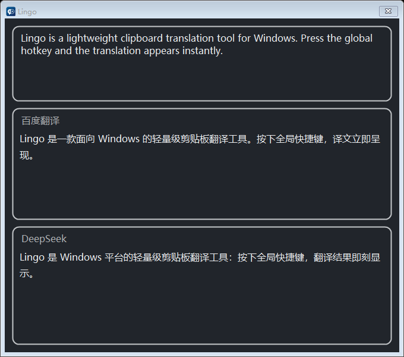

# Lingo

一款轻量的 Windows 划词翻译小工具：复制文本，按下快捷键，译文立刻弹出。

支持百度翻译和任意 AI 大模型（OpenAI / DeepSeek / Ollama 等）同时翻译、对照查看，AI 译文逐字流式显示，不用干等。

## 界面预览

## 特点

- **一键翻译**：复制任意文本，按 `Ctrl+Alt+T`（可自定义）即弹出译文，也可以直接在窗口里输入
- **多引擎对照**：百度翻译 + 多个 AI 模型并发翻译，结果并排展示，互不等待
- **流式输出**：AI 译文像聊天一样逐字出现，第一时间看到结果
- **中英互译**：中文自动译成英文，其他语言自动译成中文
- **安静省心**：平时藏在托盘里不打扰，空闲时几乎不占资源；窗口可拖动、可缩放，位置大小都会记住
- **贴心细节**：翻译结果一键复制、一键朗读；代码里的 `snake_case`、`camelCase` 会自动拆成正常单词再翻译
- **绿色免安装**：单个 exe 文件，不写注册表垃圾，删掉即卸载

## 下载安装

前往 [Releases](https://github.com/BeyondXinXin/Lingo/releases/latest) 下载最新版本，解压后运行 `Lingo.exe` 即可。

- **完整独立版（self-contained，推荐）**：解压后直接运行，无需安装任何东西
- **精简版（framework-dependent）**：体积更小，需先安装 [.NET 10 桌面运行时](https://aka.ms/dotnet/10.0/windowsdesktop-runtime-win-x64.exe)

系统要求：Windows 10/11 x64。

## 快速上手

1. 运行 `Lingo.exe`，程序会驻留在托盘（屏幕右下角小图标）
2. 右键托盘图标 → **设置**，填好翻译服务（任选其一即可）：
   - **百度翻译**：免费额度足够日常使用，[点此申请](https://fanyi-api.baidu.com/) App ID 和密钥
   - **模型翻译**：填入任意 OpenAI 兼容服务的地址、密钥和模型名，可以添加多个
3. 复制一段文字，按 `Ctrl+Alt+T`，完成！

小技巧：

- 在翻译窗口里直接改字，停顿片刻自动重新翻译；`Enter` 立即翻译，`Shift+Enter` 换行
- `Esc` 隐藏窗口（程序继续留在托盘）
- 鼠标悬停在译文上，右上角会出现朗读和复制按钮
- 设置里可以开启开机自启

## 常见问题

**快捷键按了没反应？**
可能被其他软件占用了，去设置里换一个组合键。

**配置存在哪里？**
`%LocalAppData%\BeyondXinXin\Lingo\settings.json`，日志在同目录（不会记录任何密钥）。

**想彻底删除？**
删掉 `Lingo.exe` 和上面那个配置文件夹即可。

## 开发

C# / .NET 10 / WinForms，无第三方依赖。克隆后 `dotnet run --project Lingo.csproj` 即可运行，`publish.ps1` 一键发布。
